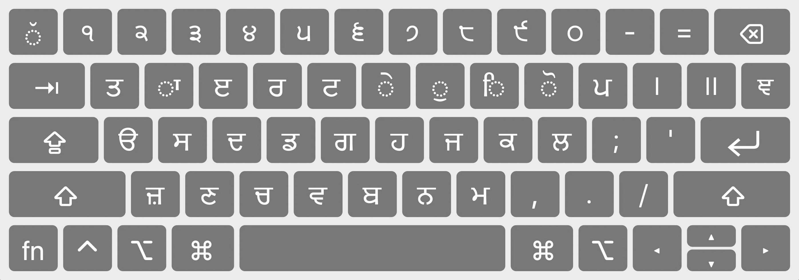

# Gurmukhi Phonetic Keyboard Layout

Allows you to type in Unicode Gurmukhi using the key mappings for the Gurbani Akhar fonts

## Key mappings

## Install
- [Download the zip file](https://github.com/gurs1kh/gurmukhi-phonetic-keyboard-layout/raw/master/dist/gurmukhi-phonetic.bundle.zip)
- Extract the contents
- Move `gurmukhi-phonetic.bundle` to `~/Library/Keyboard Layouts`

## Usage
- Go to `System Preferences > Keyboard > Input Sources`
- Click the `+` button
- Select `Punjabi` and then `Gurmukhi - Phonetic` (or just search for `Gurmukhi - Phonetic`)
- Click `Add`

For more info, see: https://support.apple.com/guide/mac-help/type-language-mac-input-sources-mchlp1406/mac
